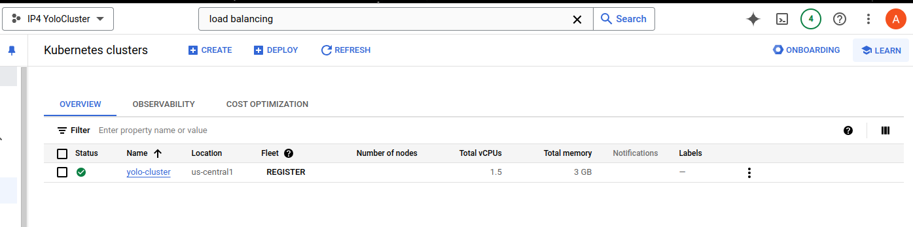
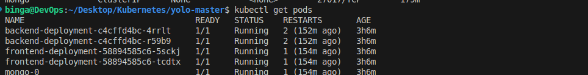
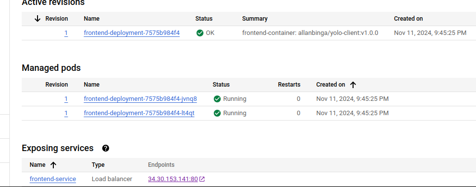
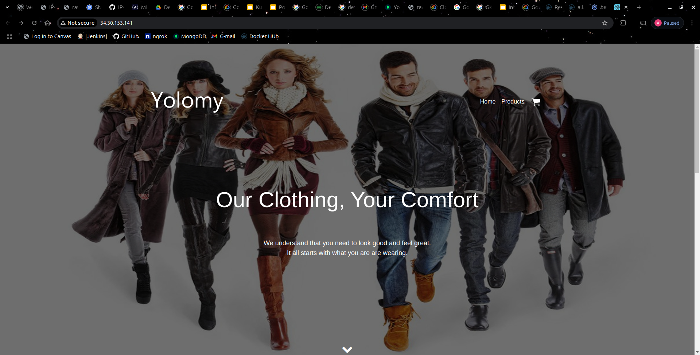
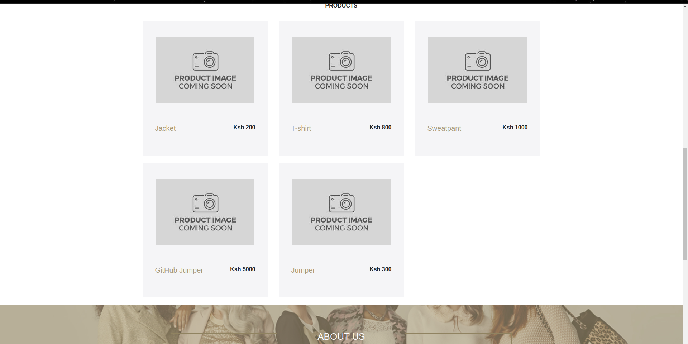

## LIve URL:

http://34.30.153.141/

## MERN Application Deployment on Kubernetes
This project is a MERN (MongoDB, Express.js, React.js, Node.js) application that has been containerized using Docker and orchestrated using Kubernetes. The backend connects to a MongoDB database, and the frontend communicates with the backend to deliver a full-featured web application. This deployment uses Google Kubernetes Engine (GKE) to host and manage the services.

# Project Overview
This project is a MERN (MongoDB, Express.js, React.js, Node.js) application that has been containerized using Docker and orchestrated using Kubernetes. The backend connects to a MongoDB database, and the frontend communicates with the backend to deliver a full-featured web application. This deployment uses Google Kubernetes Engine (GKE) to host and manage the services.

## Deeployment steps:
# Step 1: Build and push docker imaged to DockerHub
1. Build the images for frontend and backend.

```bash
docker build -t allanbinga/yolo-client:v1 .
docker build -t allabinga/yolo-backend:v1 .
```

2. Push the images to DockerHUb:
```bash
docker push allanbinga/yolo-client:v1
docker push allanbinga/yolo-backend:v1
```

# Step 2: Configure Kubernetes Manifests
Backend Deployment: Deploys the backend service and makes it accessible within the cluster.
Frontend Deployment: Deploys the frontend service and exposes it to external traffic.
MongoDB StatefulSet: Ensures persistent storage for MongoDB using Persistent Volume Claims (PVCs).

Before manifests configuration, ensure the following:

1. Install and Configure Google Cloud SDK:

Make sure you have the Google Cloud SDK installed on your local machine. You can download it from here.
Authenticate and set the default project:
```bash
    gcloud auth login
    gcloud config set project ip4-yolocluster

```

2. Enable the Kubernetes Engine API:
```bash
    gcloud services enable container.googleapis.com
```

3. Create a cluster. For my case I used the GCP platform to create a cluster named 'yolocluster' as illustrated below:



- Retrieve the cluster credentials with the region tagged:
```bash
gcloud container clusters get-credentials yolo-cluster --zone us-central1
```

# Step 3: Apply the K8s manifests:
```bash
kubectl apply -f clientk8s/ -f backendk8s/ -f mongoDBk8s/
```

# Step 4: Verify the depolyments:

1. Get the pods
```bash
kubectl get pods
```


2. Check status of your services.
```bash
kubectl get services
```
3. Note the external IP of your service;
```bash
http://34.30.153.141/
```
# In my case I navigated to the GCP cloud to be able to get the external IP address:


4. Access yuor application in the browser:



5. Add a product to test the apps functionality:




